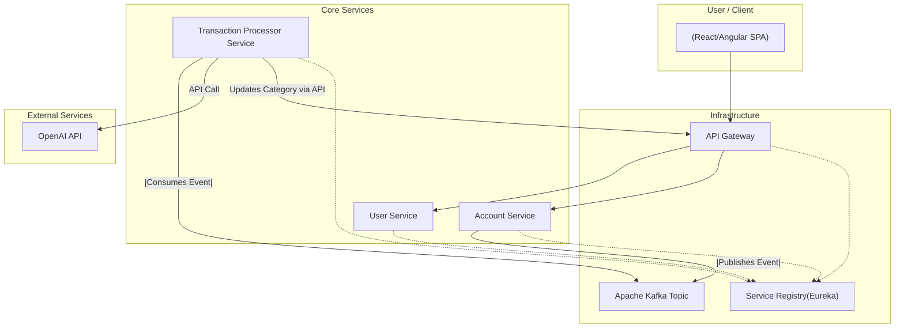

# FinSight: An AI-Powered Personal Finance Dashboard

FinSight is a modern, scalable, and intelligent personal finance application designed to provide users with deep
insights into their spending habits. It features a robust, event-driven microservices architecture built with Java and
Spring Boot, capable of processing and categorizing financial transactions using AI.

---

## Core Features

- **Secure User Authentication:** JWT-based registration and login system.
- **CSV Transaction Import:** Allows users to securely upload transaction data from their bank.
- **Asynchronous Processing:** Uses Apache Kafka to create a resilient, non-blocking data processing pipeline.
- **AI-Powered Categorization:** Integrates with OpenAI's Large Language Models (LLMs) to intelligently categorize raw
  transaction descriptions into meaningful categories.
- **Microservice Architecture:** Built with a suite of independent services for high scalability and maintainability.

---

## System Architecture

FinSight is built on an **Event-Driven Microservices** pattern. This decouples services, enhances fault tolerance, and
allows for independent scaling of components.



## Service Descriptions

1. **User Service**
    - Manages user registration, authentication, and profile management.
    - Stores user data securely in PostgresSQL.

2. **Account Service**
    - Handles bank account linking and transaction imports.
    - Publishes raw transaction events to Kafka for processing.
    - Stores account and transaction data in PostgresSQL.

3. **Transaction Processor Service**
    - Consumes raw transaction events from Kafka.
    - Utilizes OpenAI's LLMs to categorize transactions based on their descriptions.
    - Updates categorized transactions via the API Gateway.

## Technology Stack

- **Backend:** Java, Spring Boot, Spring Security, Spring Data JPA, Kafka
- **Frontend:** React or Angular (not included in this repository)
- **Database:** PostgresSQL
- **AI Integration:** OpenAI API for transaction categorization
- **Containerization:** Docker, Docker Compose
- **Service Discovery:** Eureka
- **API Gateway:** Spring Cloud Gateway
- **Build Tool:** Maven
- **Version Control:** Git

## Getting Started

### Prerequisites

- Java 17 or higher
- Maven 3.6 or higher
- Docker and Docker Compose
- PostgresSQL instance
- OpenAI API Key
- Kafka instance (can be run via Docker)

### Configuration

Set the following environment variables

```bash
   OPENAI_API_KEY=your_openai_api_key
   JWT_SECRET=your_jwt_secret

End
```

Ensure the datasource and other properties in each service's application.properties file are configured correctly.

### Running the Application

1. Start Infrastructure Services
   ```bash
   docker-compose up -d
   docker exec kafka kafka-topics --create --topic raw-transactions --bootstrap-server localhost:9092 --partitions 1 --replication-factor 1
   ```
2. Build and Run Each Microservice
   ```bash
   cd user-service
   mvn clean install
   java -jar target/user-service-0.0.1-SNAPSHOT.jar

   cd ../account-service
   mvn clean install
   java -jar target/account-service-0.0.1-SNAPSHOT.jar

   cd ../transaction-processor-service
   mvn clean install
   java -jar target/transaction-processor-service-0.0.1-SNAPSHOT.jar
   ```

3. Access the API Gateway at `http://localhost:8080`
4. Use Postman or any API client to interact with the services.

## Request-Response Examples

### User Registration

**Request:**

```http
POST /api/v1/users/register
Content-Type: application/json
{
    {
     "firstName": "John",
     "lastName": "Doe",
     "email": "john.doe@example.com", 
     "password": "securepassword123"
     }
}
```
**Response:**

```http
   {
   "message": "User registered successfully"
   }
```

### User Login
**Request:**

```http
POST /api/v1/users/login
Content-Type: application/json
{
    "email": "john.doe@example.com"
    "password": "securepassword123"
}
```

**Response:**

```http
   {
   "message": "Login Successful"
   }
 ```

## Future Implementations
- Frontend application (React or Angular)
- Implement a separate, read-optimized NoSQL database (e.g., MongoDB) to serve fast, aggregated data for the user dashboard.
- Integrate centralized logging (ELK Stack), monitoring and alerting (Prometheus/Grafana), and a full CI/CD pipeline.


   